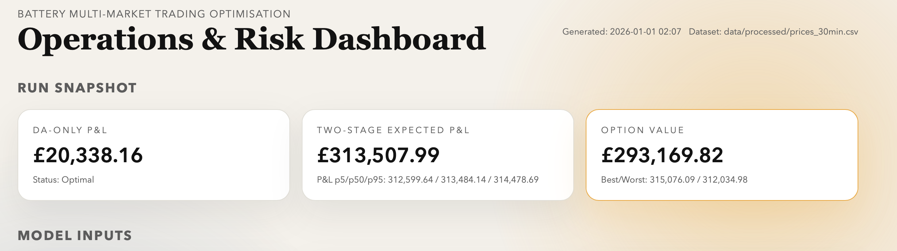
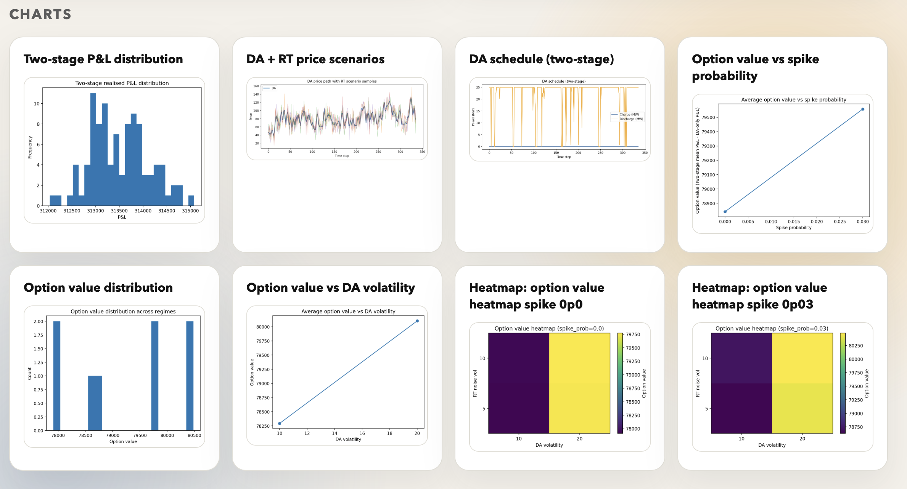

# Battery Multi-Market Trading Optimisation
Two-stage stochastic strategy for energy storage across day-ahead and real-time markets.

## Why this project adds value
Battery trading is a classic decision-under-uncertainty problem. This project turns that into a practical workflow that:
- Quantifies the **option value of flexibility** (how much RT optionality is worth).
- Produces a **full distribution of P&L**, not just a point estimate.
- Stress-tests performance across regimes, revealing **where the strategy wins or breaks**.
- Produces a **dashboard + charts** that make the results easy to communicate.

## What it does
1) **DA-only baseline**  
Deterministic arbitrage with full battery constraints to establish a clean benchmark.

2) **Two-stage stochastic optimisation**  
Stage 1 commits day-ahead dispatch. Stage 2 adapts to RT scenarios while respecting SoC, power, and efficiency.

3) **Scenario diagnostics + stress tests**  
Synthetic regime sweeps quantify how volatility, noise, and spikes change the option value.

4) **Evaluation, plots, and dashboard**  
End-to-end reporting in charts, tables, and a polished HTML dashboard.

## Key findings (from generated outputs)
- Flexibility behaves like an **option on volatility**: value increases with spike probability and RT noise.
- The two-stage model exposes **risk distribution**, not just averages (p5/p50/p95, worst, best).
- Stress tests show **regime sensitivity**, highlighting when DA commitments dominate vs when RT optionality is critical.

## How to run
### Baseline and two-stage runs
```bash
python -m src.optimisation_da_only
python -m src.optimisation_two_stage
python -m src.evaluation
```

### Stress testing (fast mode supported)
```bash
python -m src.stress_test
python -m src.plots_stress
python -m src.summarise
```

Fast iteration:
```bash
python -m src.stress_test --fast
```

### Dashboard
```bash
python -m src.dashboard
open outputs/dashboard.html
```

## Outputs
- Tables: `outputs/tables/`
- Charts: `outputs/charts/`
- Summary text: `outputs/summaries/`
- Dashboard: `outputs/dashboard.html`

## Dashboard and charts (snapshots)
These images are generated by the pipeline and appear in the dashboard.

### Dashboard run snapshot


### Dashboard charts panel


### P&L distribution


### Price scenarios (DA + RT)


### DA schedule (two-stage)


### Option value vs spike probability


### Option value distribution


### Option value vs DA volatility


## Project structure
- `configs/` model assumptions and parameters
- `src/` scenario generation, optimisation, evaluation, plotting, dashboard
- `outputs/` charts, tables, summaries, dashboard
- `tests/` sanity checks


